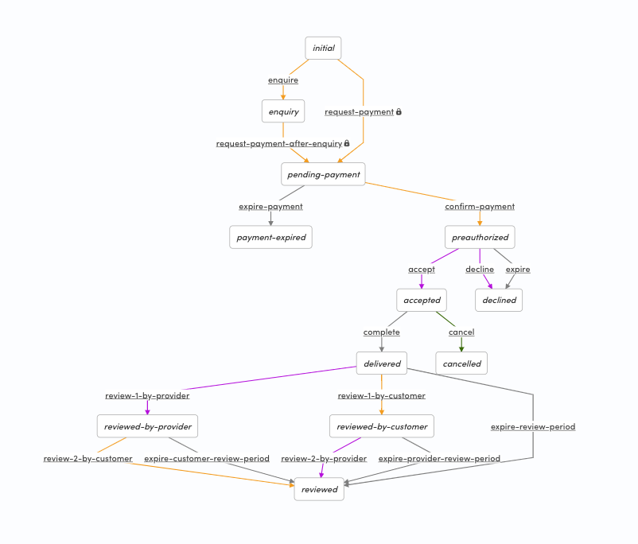
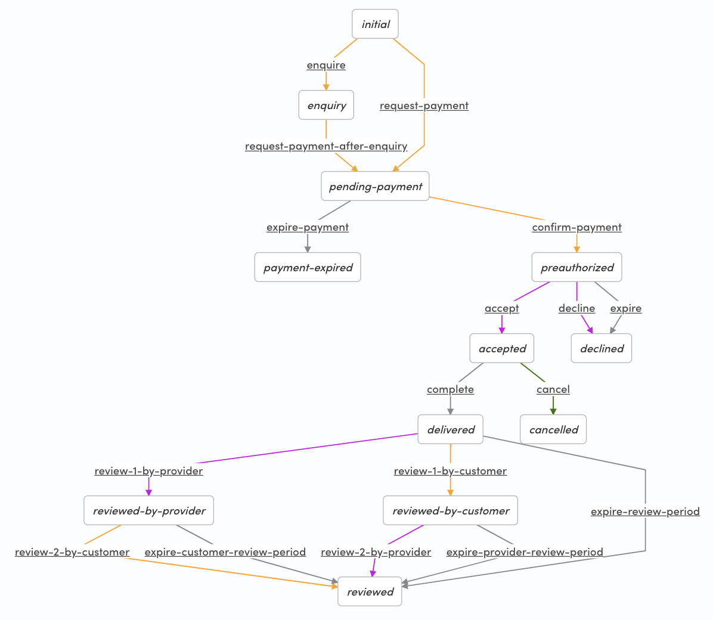
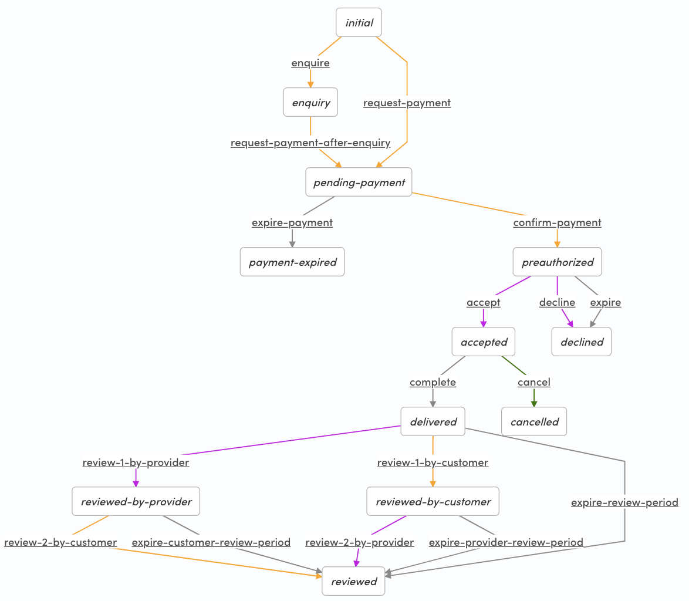
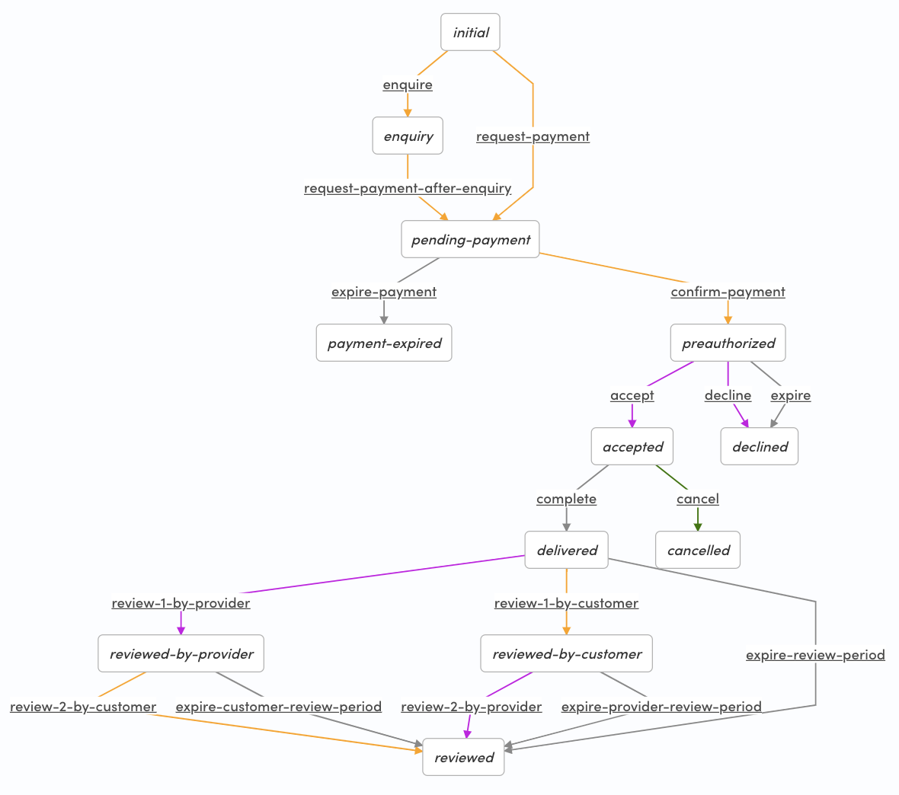
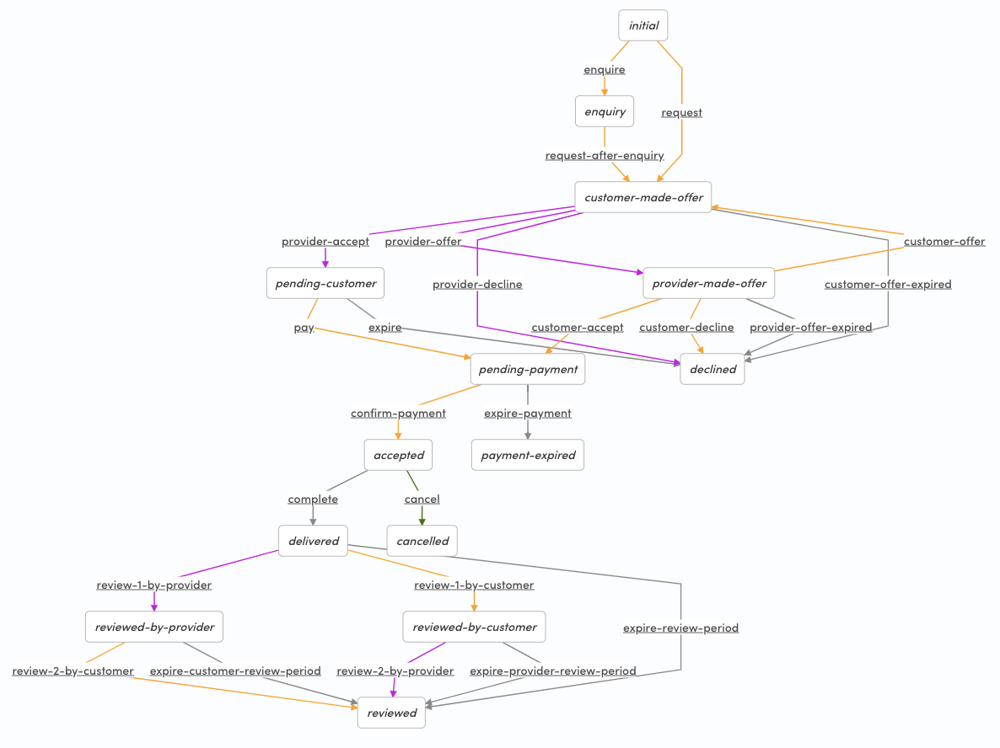

# Sharetribe Flex example transaction processes

This repository contains example transaction processes and the email
templates for [Sharetribe
Flex](https://www.sharetribe.com/flex/). These processes can be used
as starting points for customizing your marketplace using Flex CLI.

## Prerequisites

To understand the transaction engine in Sharetribe Flex, see the
[Transaction process
article](https://www.sharetribe.com/docs/background/transaction-process/)
in Flex Docs.

To get up and running with Flex CLI, see the [Getting started with
Flex
CLI](https://www.sharetribe.com/docs/flex-cli/getting-started-with-flex-cli/)
guide in Flex Docs.

## Usage

Clone this repository:

```
git clone git@github.com:sharetribe/flex-example-processes.git
```

Change to the cloned directory:

```
cd flex-example-processes
```

Let's use `my-marketplace-id` as an example Marketplace ID and
`preauth-daily-booking` as the process that is taken into use.

Using the example processes, create a new process to your marketplace:

```
flex-cli process create -m my-marketplace-id --process preauth-daily-booking --path preauth-daily-booking
```

Create an alias to the process:

```
flex-cli process create-alias -m my-marketplace-id --process preauth-daily-booking --version 1 --alias release-1
```

Check that everything is good:

```
flex-cli process list -m my-marketplace-id --process preauth-daily-booking
```

Then set up your FTW customization to use that process alias and
continue customizing your process and UI.

## Learn more

For customizing the transaction process, see the [transaction process
format
guide](https://gist.github.com/ovan/7b436bb73ef3b49993ba2e3a9e9df59d).

For editing the transactional email templates, see the [Email
templates
reference](https://www.sharetribe.com/docs/references/email-templates/)
in Flex Docs.

## Processes

The example processes are meant to showcase some of the capabilities
of the transaction engine. See the differences in the `process.edn`
files in each process directory to see how they differ only slightly.

All the processes support [Strong Customer Authentication
(SCA)](https://www.sharetribe.com/docs/background/strong-customer-authentication/).

The example processes differ mostly in availability management and
pricing. To understand these concepts, see the [Listing availability
management](https://www.sharetribe.com/docs/references/availability/)
and [Custom
pricing](https://www.sharetribe.com/docs/background/custom-pricing/)
articles in Flex Docs.

### flex-default-process:

This is the default process that is created in our backend for new
test marketplaces.

When used in [Flex Template for Web
(FTW)](https://github.com/sharetribe/flex-template-web) customizing
[pricing](https://www.sharetribe.com/docs/background/pricing/) can be
done within FTW by utilizing [privileged
transitions](https://www.sharetribe.com/docs/background/privileged-transitions/).



### flex-hourly-default-process:

This is the default for FTW-houly. It's otherwise similar to `flex-default-process` but it uses the time-based availability (i.e. action create-booking has type time).

When used in [Flex Template for Web
(FTW)](https://github.com/sharetribe/flex-template-web) customizing
[pricing](https://www.sharetribe.com/docs/background/pricing/) can be
done within FTW by utilizing [privileged
transitions](https://www.sharetribe.com/docs/background/privileged-transitions/).


### preauth-nightly-booking:

**DEPRECATED** The current default process is named `flex-default-process`.

This is the default process that is created in our backend for new
test marketplaces and what [Flex Template for Web
(FTW)](https://github.com/sharetribe/flex-template-web) expects as the
default.

In this process listings are booked for full nights.


### preauth-daily-booking:

**DEPRECATED** The current default process is named
`flex-default-process` and it can perform the
`preauth-daily-booking` functionality.

This is very similar to the `preauth-nightly-booking` process, but
bookings are made for full days, not nights.

If you use daily bookings, make sure to change the `bookingUnitType`
in the [FTW
config](https://github.com/sharetribe/flex-template-web/blob/master/src/config.js)
accordingly.



### preauth-unit-booking:

**DEPRECATED** The current default process is named
`flex-default-process` and it can perform the
`preauth-unit-booking` functionality.

This process calculates the total price by units, not the booking
times. The total price is calculated by multiplying the listing price
by the `quantity` sent in the transition request.

Note: this process doesn't have availability management enabled since
the `:action/create-booking` action doesn't set the
`:observe-availability?` config option.

If you use unit bookings, make sure to change the `bookingUnitType` in
the [FTW
config](https://github.com/sharetribe/flex-template-web/blob/master/src/config.js)
accordingly.



### preauth-unit-time-booking:

**DEPRECATED** The current default process is named
`flex-default-process` and it can perform the
`preauth-unit-time-booking` functionality when `create-booking`
action is updated with config parameter `:type :time`.

This process is similar to the `preauth-unit-booking` process, but has
the time-based availability management enabled. The transaction prices
are calculated based on units.

With daily and nightly bookings, the time component of booking start
and end is normalized to UTC midnight. With the time-based
availability in this process, also the time component of the bookings
dates is relevant.

Note that currently FTW doesn't support time-based availability
management, but we are working on a version that has all the relevant
UI components in place for time-based bookings and availability
management.



### negotiated-nightly-booking:

This process differs clearly from the other processes as seen in the
visualization below. It uses price negotiation where the customer and
provider can negotiate a new total price for the transaction.

The transitions for the negotiation showcase an example how to handle
the negotiation in an offering phase before moving onto the payment.

Note that price negotiation is just one way to customize the
pricing. There is also the powerful [Custom
pricing](https://www.sharetribe.com/docs/background/custom-pricing/)
that enables lots of use cases for transaction pricing.


