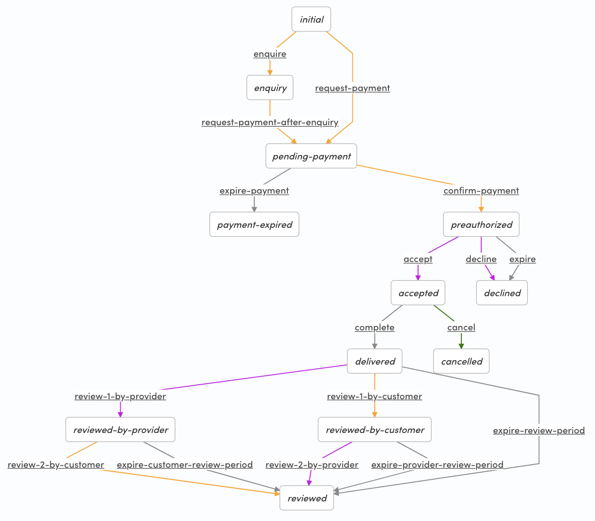

# Sharetribe Flex default transaction processes

This repository contains the default transaction processes and the
email templates for [Sharetribe
Flex](https://www.sharetribe.com/flex/). These processes can be used
as starting points for customizing your marketplace using Flex CLI.

## Prerequisites

To understand the transaction engine in Sharetribe Flex, see the
[Transaction process
article](https://www.sharetribe.com/docs/background/transaction-process/)
in Flex Docs.

To get up and running with Flex CLI, see the [Getting started with
Flex
CLI](https://deploy-preview-177--sharetribe-flex-docs-site.netlify.com/docs/tutorials/getting-started-with-flex-cli/)
tutorial in Flex Docs.

## Usage

Clone this repository:

```
git clone git@github.com:sharetribe/flex-default-processes.git
```

Change to the cloned directory:

```
cd flex-default-processes
```

Let's use `my-marketplace-id` as an example Marketplace ID and
`sca-preauth-daily-booking` as the default process that is taken into
use.

Using the defaults, create a new process to your marketplace:

```
flex-cli process create -m my-marketplace-id --process sca-preauth-daily-booking --path sca-preauth-daily-booking
```

Create an alias to the process:

```
flex-cli process create-alias -m my-marketplace-id --process sca-preauth-daily-booking --version 1 --alias release-1
```

Check that everything is good:

```
flex-cli process list -m my-marketplace-id --process sca-preauth-daily-booking
```

Then set up your FTW customization to use that process alias and
continue customizing your process and UI.

## Learn more

For customizing the transaction process, see the [transaction process
format
guide](https://gist.github.com/ovan/7b436bb73ef3b49993ba2e3a9e9df59d).

For editing the transactional email templates, see the [Email
templates
reference](https://www.sharetribe.com/docs/references/email-templates/)
in Flex Docs.

## Processes

### sca-negotiated-nightly-booking:


### sca-preauth-daily-booking:


### sca-preauth-nightly-booking:



### sca-preauth-unit-booking:


### sca-preauth-unit-time-booking:


