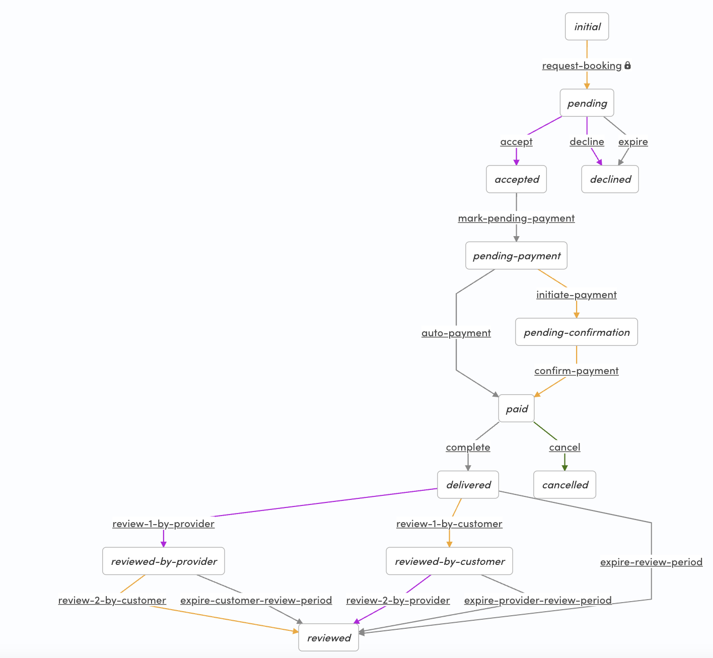

# Sharetribe example transaction processes

This repository contains example transaction processes and the email
templates for [Sharetribe](https://www.sharetribe.com/). These processes can be used
as starting points for customizing your marketplace using Sharetribe CLI.

## Prerequisites

To understand the transaction engine in Sharetribe, see the
[Transaction process
article](https://www.sharetribe.com/docs/concepts/transaction-process/)
in Sharetribe Developer Docs.

To get up and running with Sharetribe CLI, see the [Getting started with
Sharetribe
CLI](https://www.sharetribe.com/docs/introduction/getting-started-with-sharetribe-cli/)
guide in Sharetribe Developer Docs.

## Usage

Clone this repository:

```
git clone git@github.com:sharetribe/sharetribe-example-processes.git
```

Change to the cloned directory:

```
cd sharetribe-example-processes
```

Let's use `my-marketplace-id` as an example Marketplace ID and
`instant-booking` as the process that is taken into use.

Using the example processes, create a new process to your marketplace:

```
flex-cli process create -m my-marketplace-id --process instant-booking --path instant-booking
```

Create an alias to the process:

```
flex-cli process create-alias -m my-marketplace-id --process instant-booking --version 1 --alias release-1
```

Check that everything is good:

```
flex-cli process list -m my-marketplace-id --process instant-booking
```

Then set up your Sharetribe Web Template customization to use that process alias and
continue customizing your process and UI. You can find process-specific suggestions in the README.md file of each process.

## Learn more

For customizing the transaction process, see the [transaction process
format
guide](https://www.sharetribe.com/docs/references/transaction-process-format/).

For editing the transactional email templates, see the [Email
templates
reference](https://www.sharetribe.com/docs/references/email-templates/)
in Sharetribe Developer Docs.

## Processes

The example processes are meant to showcase some of the capabilities
of the transaction engine. See the differences in the `process.edn`
files in each process directory to see how they differ only slightly.

All the payment processes support [Strong Customer Authentication
(SCA)](https://www.sharetribe.com/docs/background/strong-customer-authentication/).

The example processes differ mostly in availability management and
pricing. To understand these concepts, see the [Listing availability
management](https://www.sharetribe.com/docs/references/availability/)
and [Custom
pricing](https://www.sharetribe.com/docs/background/custom-pricing/)
articles in Sharetribe Developer Docs.

### default-booking:

This is the default process that is created in our backend for new
test marketplaces and used for bookings.

When used in **Sharetribe Web Template** ([web-template](https://github.com/sharetribe/web-template/)) customizing
[pricing](https://www.sharetribe.com/docs/concepts/pricing/) can be
done within the template by utilizing [privileged
transitions](https://www.sharetribe.com/docs/concepts/privileged-transitions/).


### default-purchase:

This is the default process that is created in our backend for new
test marketplaces and used for purchases. It is a
transaction process designed for product selling with shipping or pickup, and it
uses the Sharetribe stock management features.

When used in **Sharetribe Web Template** ([web-template](https://github.com/sharetribe/web-template/)) customizing
[pricing](https://www.sharetribe.com/docs/concepts/pricing/) can be
done within the template by utilizing [privileged
transitions](https://www.sharetribe.com/docs/concepts/privileged-transitions/).


### default-inquiry:

This is the default process that is created in our backend for new test marketplaces and used for free messaging. Its only function is to start a transaction so participants can send messages within the context of that transaction. The process does not use any payment, booking, or stock features.


### default-negotiation:

This is the default process that is created in our backend for new test
marketplaces and used for price negotiation. The process supports
transactions initiated by both the provider and the customer. This means
it enables both a regular or forward marketplace flow, where the
provider creates a listing and the customer starts the transaction, and
a reverse marketplace flow, where the customer creates a listing and the
provider starts the transaction.

This process involves a price negotiation logic, where the customer and
provider can negotiate a total price for the transaction. This process does
not involve any booking or stock actions, but it does include a change
request loop after the item is delivered. In the change request loop,
the customer can request changes to the delivered product before accepting
the end result as successfully delivered.

As of October 2025, the **Sharetribe Web Template**
([web-template](https://github.com/sharetribe/web-template/)) supports
using the transaction process for reverse transactions. Support for a
forward price negotiation flow is on our roadmap, but it is currently
not supported by the template.

See the [negotiated process article](https://www.sharetribe.com/docs/concepts/negotiation-process/) for more details on the _default-negotiation_ process.


### instant-booking:

This is an example of instant booking supporting both card and push payment methods.

See [payment methods overview](https://www.sharetribe.com/docs/concepts/payment-methods-overview/) for more info.

The [README.md](./instant-booking/README.md) file in the process folder describes how to take the process into use in the Sharetribe Web Template.


### negotiated-booking:

This process also uses price negotiation where the customer and
provider can negotiate a new total price for the transaction.
The process also creates a booking against the associated listing's availability.

The transitions for the negotiation showcase an example how to handle
the negotiation in an offering phase before moving onto the payment.
The price negotiation logic in this process is simpler than in the
[default-negotiation](#default-negotiation) process.

The [README.md](./negotiated-booking/README.md) file in the process folder describes how to take the process into use in the Sharetribe Web Template.

Note that price negotiation is just one way to customize the
pricing. Our powerful [Custom
pricing](https://www.sharetribe.com/docs/concepts/custom-pricing/) enables several use cases for transaction pricing.

In addition to price negotiation, you can also add a functionality to negotiate the booking days within the process. For this use case, you would need to add the [`update-booking` action](https://www.sharetribe.com/docs/references/transaction-process-actions/#actionupdate-booking) to the negotiation transitions, and pass the new suggested booking times as transition parameters. To do this, you would need to make sure in your client app that the listing has availability for the suggested new booking time.


### automatic-off-session-payment

This process makes it possible to create bookings for more than 90 days in the future and still use the default Stripe integration. The automatic off-session payment process creates the booking when the transaction is initiated, but handles the payment closer to the actual booking time. See the [automatic off-session payments article](https://www.sharetribe.com/docs/concepts/off-session-payments-in-transaction-process/) for more information.

The [README.md](./automatic-off-session-payment/README.md) file in the process folder describes how to take the process into use in the Sharetribe Web Template.

